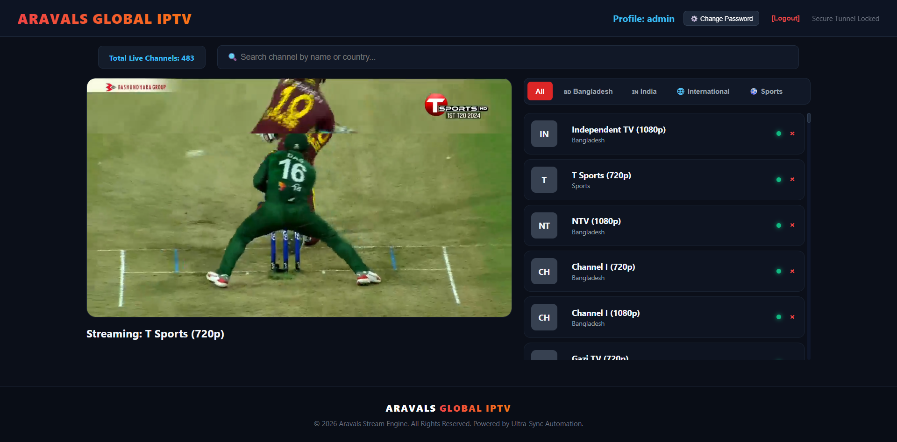

# 🚀 Aravals Global IPTV Platform

An advanced, high-performance Live IPTV Streaming Engine featuring a centralized **Master Playlist Architecture**, automated **10-Minute Background Validation**, and a real-time **Admin Command Center** powered by WebSockets.

---

## 📸 Platform Overview & Live Preview

Here is a glimpse of the premium dark-themed corporate interface running with optimized stream tracking, automated live status monitoring, and custom animations:


> *Note: If your dashboard image filename or path changes, make sure to move your screenshot to `public/image_147803.png` or update the path above.*

---

## ⚡ Core Engine Features

* **Role-Based Access Control (RBAC):** Tight structural security. Only the verified `admin` account can access the automated `.m3u` playlist injector and control the channel matrix.
* **Centralized Stream Inventory:** Clients and viewers can securely log in, search, filter, and stream live content without messing with the core database layout or adding duplicates.
* **10-Minute Smart Automation Engine:** Powered by background `node-cron` workers. Downed or broken streaming sources are automatically switched to `deactive` states without wiping database logs, and are instantly **auto-recovered** once the stream target comes back online.
* **Duplicate & Dead-link Prevention:** Strict backend input validation prevents channel duplication on name/URL matching and checks live stream authenticity before saving.
* **Admin Command Center:** Real-time metrics visualization showing total registered clients, stored channels, active live streaming sessions, and immediate client activity streams via Socket.io.
* **Secure Authentication Pipeline:** Production-ready `express-session` combined with `bcrypt` password hashing and a dynamic dashboard-controlled password changing feature.

---

## 🛠️ Architecture & Tech Stack

| Tier | Technologies Used |
| :--- | :--- |
| **Frontend UI/UX** | Responsive HTML5, Custom CSS Grid/Flexbox, Shaka Player (HLS/DASH Polyfills) |
| **Backend Framework** | Node.js, Express.js, Express-Session, Node-Cron |
| **Real-Time Pipeline** | Socket.io (WebSockets Interceptors) |
| **Database Engine** | MySQL (Connection Pooling Architecture via `mysql2`) |
| **Validation Core** | Native Linux Async `curl` subprocess networking engines |

---

## ⚙️ Quick Installation & Setup

Follow these simple steps to spin up the production ecosystem locally:

### 1. Database Setup
Execute the table migration scripts inside your MySQL database instances:

```sql
CREATE DATABASE iptv_db;
USE iptv_db;

CREATE TABLE users (
    id INT AUTO_INCREMENT PRIMARY KEY,
    username VARCHAR(50) UNIQUE NOT NULL,
    password VARCHAR(255) NOT NULL,
    created_at TIMESTAMP DEFAULT CURRENT_TIMESTAMP
);

CREATE TABLE channels (
    id INT AUTO_INCREMENT PRIMARY KEY,
    name VARCHAR(255) NOT NULL,
    logo VARCHAR(255),
    url TEXT NOT NULL,
    referer TEXT,
    country VARCHAR(100),
    user_session VARCHAR(50),
    status VARCHAR(20) DEFAULT 'active'
);
